# TP5 - Systèmes de fichiers, partitions et disques

Dans ce cinquième TP, nous allons manipuler divers outils de gestion des disques et partitions, ainsi que le partitionnement
LVM. Nous verrons comment créer des points de montage et monter des partitions.

## Exercice 1 :  Disques et partitions

1. ***Dans l’interface de configuration de votre VM, créez un second disque dur, de 5 Go dynamiquement alloués ; puis démarrez la VM.***

Pour créé un seconde disque dur de 5 Go dynamiquement alloués dans l'interface de configuration de ma machine virtuelle j'ai procédé de la manière suvante :

1. Modifier les paramètres
2. Ajouter un périphérique --> Disque dure
3. Allouer 5 Go pour le nouveu disque dur

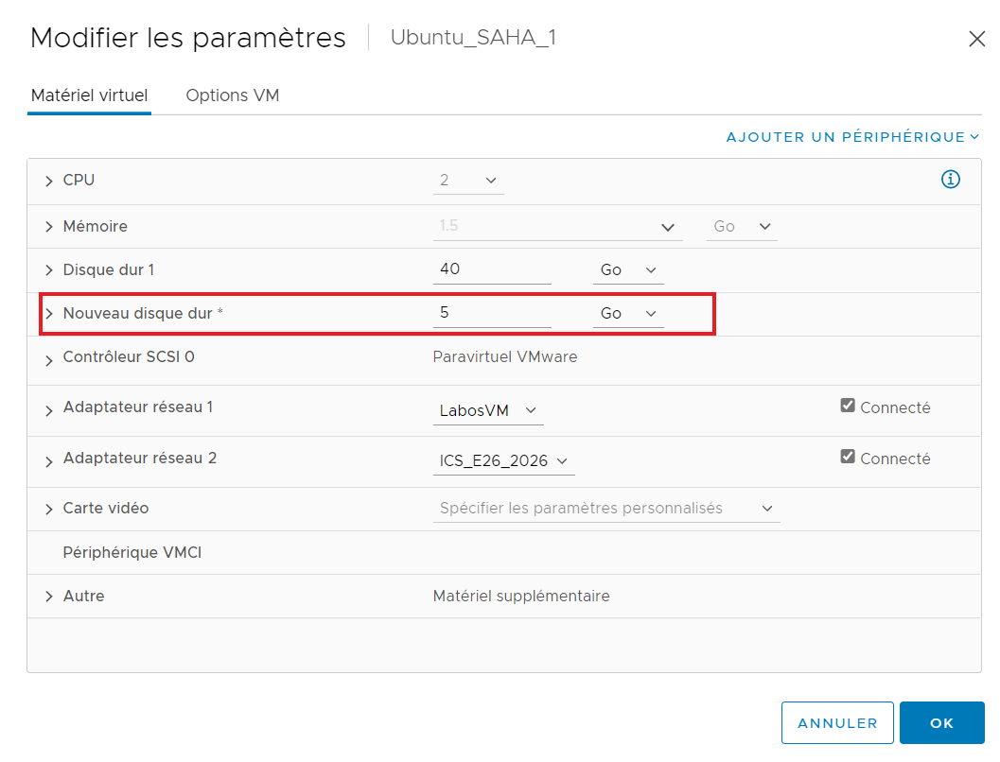

2. ***Vérifiez que ce nouveau disque dur est bien détecté par le système***

```consol
    User@client:~$ sudo fdisk -l
```

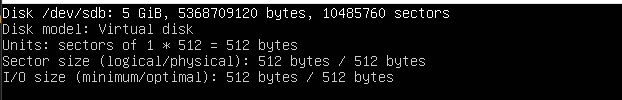

3. ***Partitionnez ce disque en utilisant `fdisk` : créez une première partition de 2 Go de type `Linux` (n°83), et une seconde partition de 3 Go en `NTFS` (n°7)***

```consol
    User@client:~$ sudo fdisk /dev/sdb
```
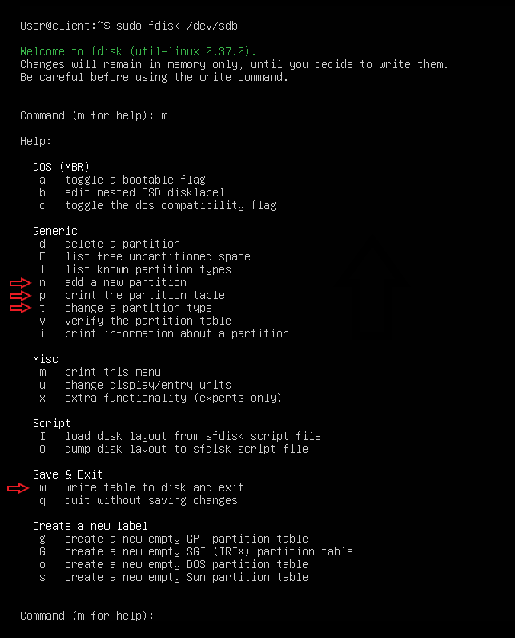

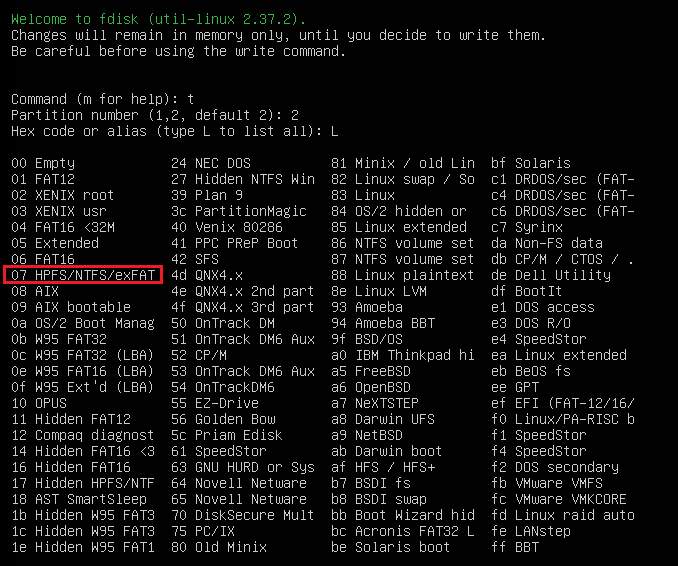

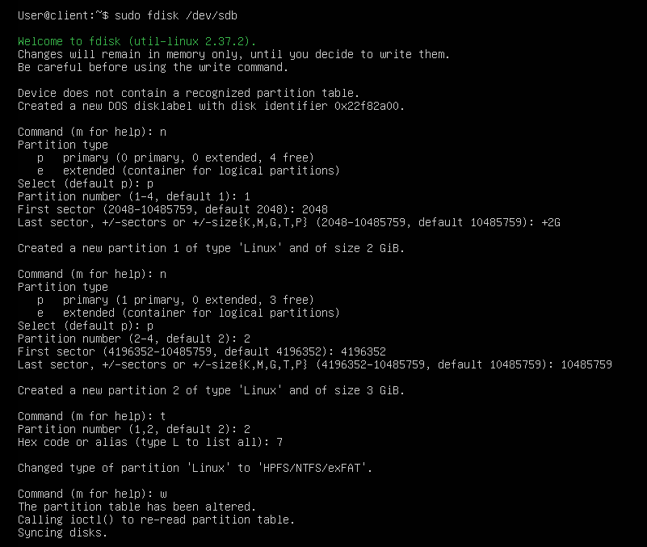

A l'aide de la commande `lsblk` on vérifie bien que les deux partitions ont été créé.

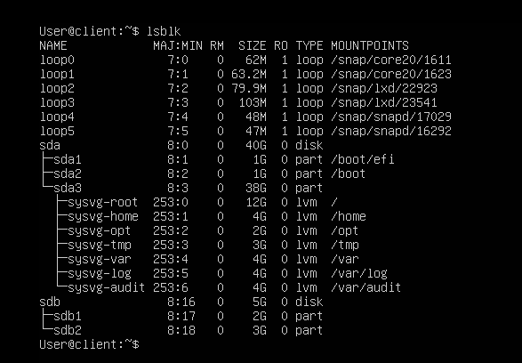

4. ***A ce stade, les partitions ont été créées, mais elles n’ont pas été formatées avec leur système de fichiers. A l’aide de la commande `mkfs`, formatez vos deux partitions (pensez à consulter le manuel !)***

Pour formater la première partition j'ai utilisé la commande `sudo mkfs.ext4 /dev/sdb1`

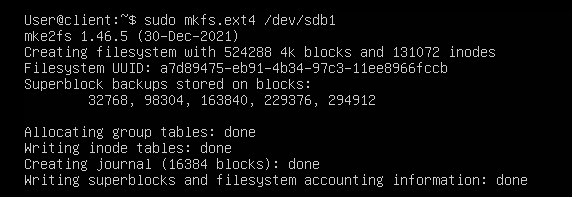

Pour formater la deuxième partition j'ai utilisé la commande `sudo mkfs.ntfs /dev/sdb1`

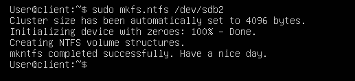

5. ***Pourquoi la commande `df -T`, qui affiche le type de système de fichier des partitions, ne fonctionne-t-elle pas sur notre disque ?***

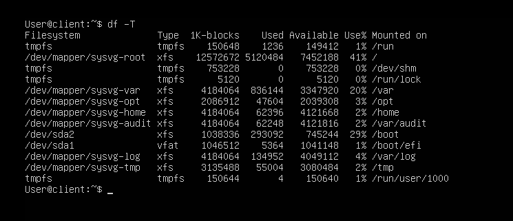

Cette commande ne fonctionne pas sur notre système car le système de fichier n'est pas encore monté.

6. ***Faites en sorte que les deux partitions créées soient montées automatiquement au démarrage de la machine, respectivement dans les points de montage `/data` et `/win` (vous pourrez vous passer des UUID en raison de l’impossibilité d’effectuer des copier-coller)***

```consol
    User@client:~$ sudo mkdir /media/data
    User@client:~$ sudo mkdir /media/win
    User@client:~$ sudo nano /etc/fstab
```

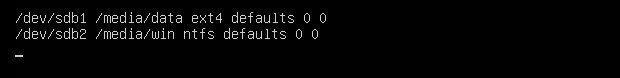

7. ***Utilisez la commande `mount` puis redémarrez votre VM pour valider la configuration***

```consol
    User@client:~$ sudo mount -a /dev/sdb1 /media/data
    User@client:~$ sudo mount -a /dev/sdb2 /media/win
    User@client:~$ reboot
```

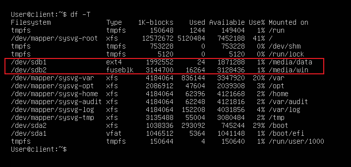

8. ***Montez votre clé USB dans la VM***

9. ***Créez un dossier partagé entre votre VM et votre système hôte (rem. il peut être nécessaire d’installer les Additions invité de VirtualBox).***

## Exercice 2. Partitionnement LVM

**Dans cet exercice, nous allons aborder le partitionnement LVM, beaucoup plus flexible pour manipuler les disques et les partitions.**

1. ***On va réutiliser le disque de 5 Gio de l’exercice précédent. Commencez par démonter les systèmes de fichiers montés dans `/data` et `/win` s’ils sont encore montés, et supprimez les lignes correspondantes du fichier `/etc/fstab`***

```consol
    User@client:~$ sudo umount /media/data
    User@client:~$ sudo umount /media/win
```
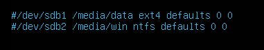

2. ***Supprimez les deux partitions du disque, et créez une partition unique de type LVM.***

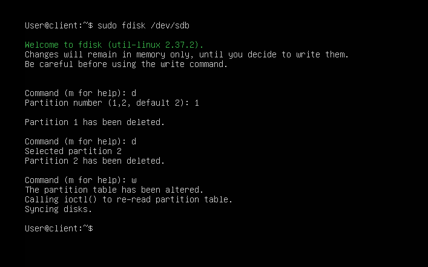

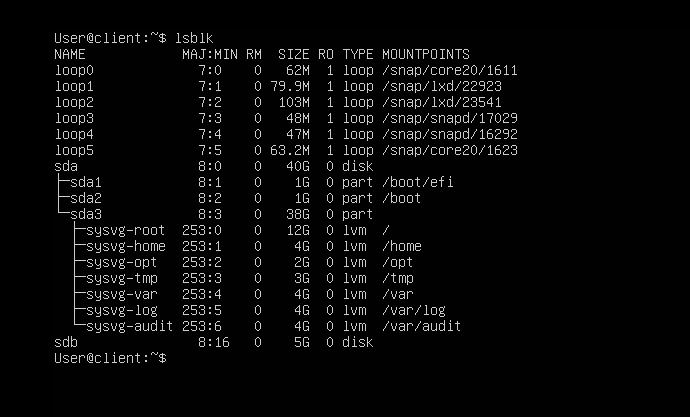

***- La création d’une partition LVM n’est pas indispensable, mais vivement recommandée quand on utilise LVM sur un disque entier. En effet, elle permet d’indiquer à d’autres OS ou logiciels de gestion de disques (qui ne reconnaissent pas forcément le format LVM) qu’il y a des données sur ce disque.***

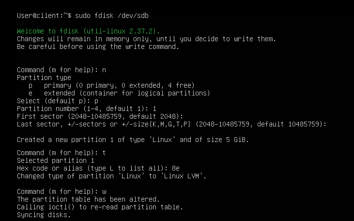

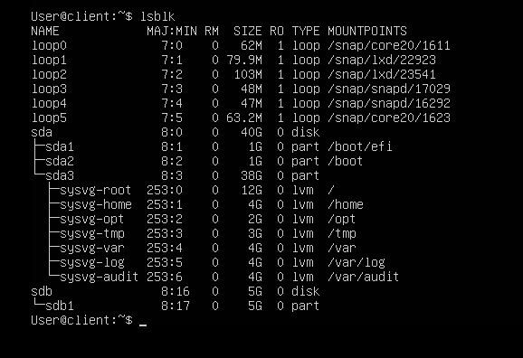

***- Attention à ne pas supprimer la partition système !***

3. ***A l’aide de la commande `pvcreate`, créez un volume physique LVM. Validez qu’il est bien créé, en utilisant la commande `pvdisplay`.***

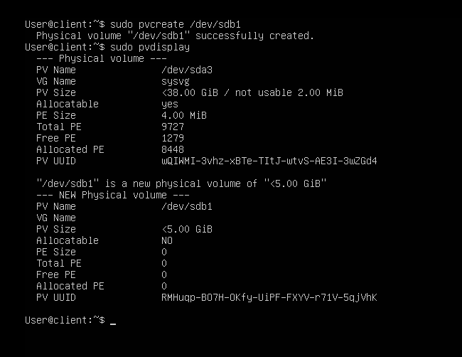

***Toutes les commandes concernant les volumes physiques commencent par pv. Celles concernant les groupes de volumes commencent par vg, et celles concernant les volumes logiques par lv.***

4. ***A l’aide de la commande `vgcreate`, créez un groupe de volumes, qui pour l’instant ne contiendra que le volume physique créé à l’étape précédente. Vérifiez à l’aide de la commande `vgdisplay`.***

***- Par convention, on nomme généralement les groupes de volumes vgxx (où xx représente l’indice du groupe de volume, en commençant par 00, puis 01...)***

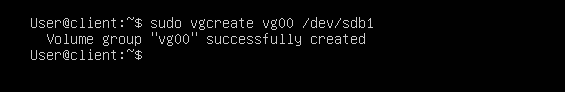

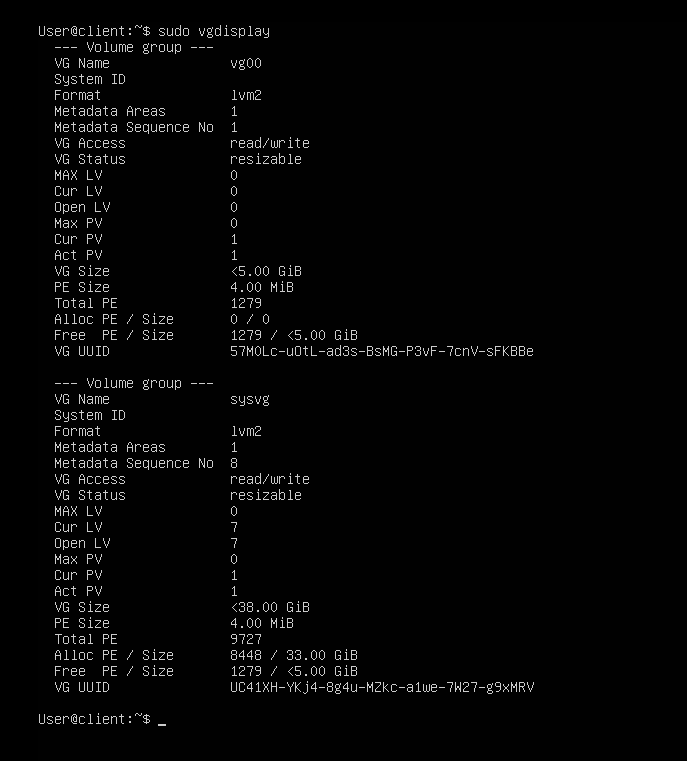

5. ***Créez un volume logique appelé `lvData` occupant l’intégralité de l’espace disque disponible.***

***- On peut renseigner la taille d’un volume logique soit de manière absolue avec l’option -L (par exemple -L 10G pour créer un volume de 10 Gio), soit de manière relative avec l’option -l : -l 60%VG pour utiliser 60% de l’espace total du groupe de volumes, ou encore -l 100%FREE pour utiliser la totalité de l’espace libre.***

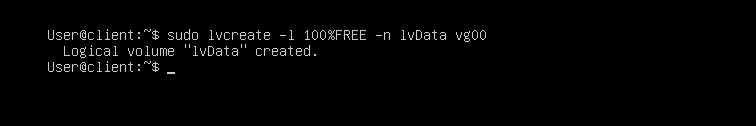

6. ***Dans ce volume logique, créez une partition que vous formaterez en ext4, puis procédez comme dans l’exercice 1 pour qu’elle soit montée automatiquement, au démarrage de la machine, dans `/data`.***

***- A ce stade, l’utilité de LVM peut paraître limitée. Il trouve tout son intérêt quand on veut par exemple agrandir une partition à l’aide d’un nouveau disque.***

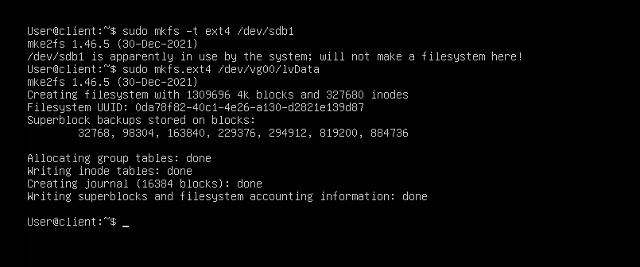

Pour le montage de manière automatique au démarrage j'ai procédé de la même manière que dans les questions 6 et 7 de l'exercice 1.

7. ***Eteignez la VM pour ajouter un second disque (peu importe la taille pour cet exercice). Redémarrez la VM, vérifiez que le disque est bien présent. Puis, répétez les questions 2 et 3 sur ce nouveau disque.***

J'ai procédé de la même manière que dans la question 1 de l'exercice 1 ainsi que dans des questions 2 et 3 de l'exercice 2.

8. ***Utilisez la commande `vgextend <nom_vg> <nom_pv>` pour ajouter le nouveau disque au groupe de volumes***

```consol
    User@client:~$ sudo vgextend vg00 /dev/sdc

      Volume group "vg00" successfully extended
```

9. ***Utilisez la commande `lvresize` (ou `lvextend`) pour agrandir le volume logique. Enfin, il ne faut pas oublier de redimensionner le système de fichiers à l’aide de la commande `resize2fs`.***

***- Il est possible d’aller beaucoup plus loin avec LVM, par exemple en créant des volumes par bandes (l’équivalent du RAID 0) ou du mirroring (RAID 1). Le but de cet exercice n’était que de présenter les fonctionnalités de base.***

```consol
    User@client:~$ sudo lvresize -L +10G /dev/vg00/lvData
```
```consol
    User@client:~$ sudo resize2fs /dev/vg00/lvDat
```